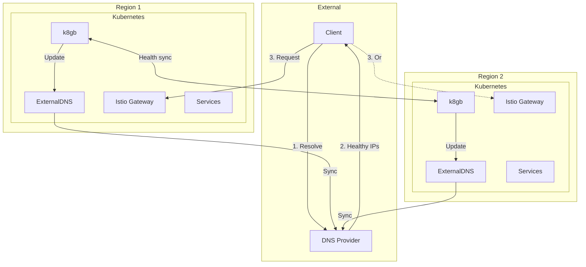
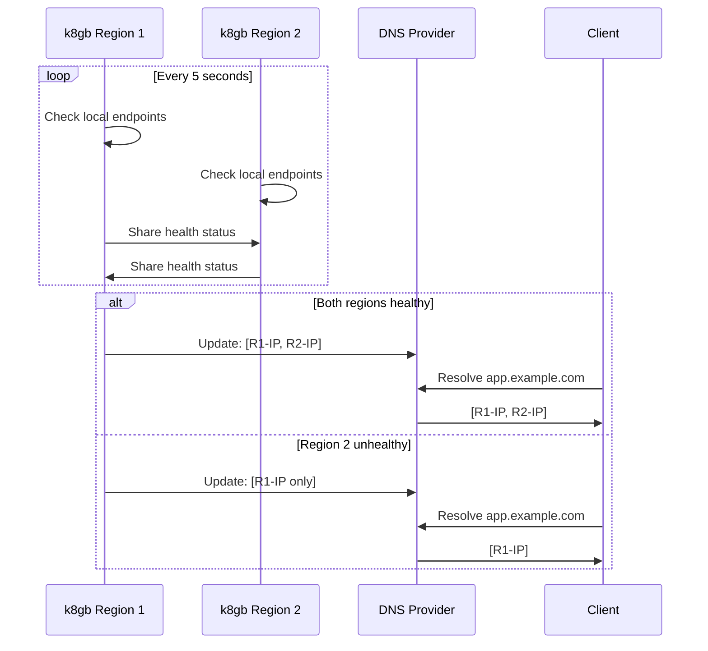
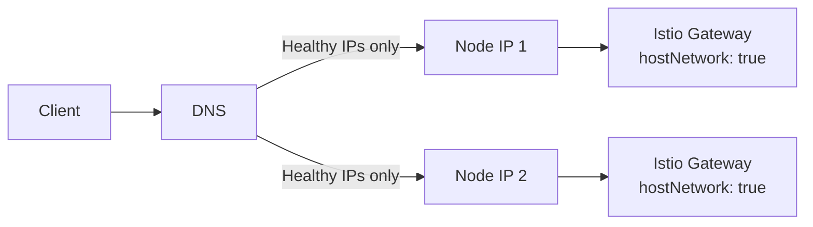

# ADR: k8gb for Global Server Load Balancing

**Status:** Accepted
**Date:** 2024-10-01
**Updated:** 2026-01-16

## Context

Need cross-region DNS-based load balancing that:
- Routes traffic to healthy endpoints only
- Supports active-active and active-passive strategies
- Works without external GSLB services (self-hosted)
- Integrates with ExternalDNS for DNS record management

## Decision

Use **k8gb** (Kubernetes Global Balancer) for cross-region GSLB with health-based DNS routing.

## Architecture



## How k8gb Works

### Health-Based DNS Routing



### k8gb as "Poor Man's LoadBalancer"

For cost-conscious deployments without cloud LoadBalancers:



**How it works:**
1. Istio Gateway uses `hostNetwork: true` to bind directly to node IPs
2. k8gb health-checks the Gateway endpoints
3. k8gb updates DNS to only include healthy node IPs
4. Client connects directly to healthy nodes

**Cost:** Free (no cloud LoadBalancer required)

## Routing Strategies

| Strategy | Description | Use Case |
|----------|-------------|----------|
| `roundRobin` | Even distribution across healthy endpoints | Active-Active |
| `failover` | Primary region preferred, DR on failure | Active-Passive |
| `geoip` | Route by client geography | Latency optimization |

## Configuration

### Gslb Custom Resource

```yaml
apiVersion: k8gb.absa.oss/v1beta1
kind: Gslb
metadata:
  name: <tenant>-app
  namespace: <tenant>
spec:
  ingress:
    ingressClassName: istio
    rules:
      - host: app.<domain>
        http:
          paths:
            - path: /
              pathType: Prefix
              backend:
                service:
                  name: app-service
                  port:
                    number: 80
  strategy:
    type: roundRobin  # or failover, geoip
    splitBrainThresholdSeconds: 300
    dnsTtlSeconds: 30
```

### k8gb Deployment

```yaml
apiVersion: apps/v1
kind: Deployment
metadata:
  name: k8gb
  namespace: k8gb
spec:
  replicas: 1
  template:
    spec:
      containers:
        - name: k8gb
          image: absaoss/k8gb:v0.12.0
          args:
            - --config=/etc/k8gb/config.yaml
          env:
            - name: CLUSTER_GEO_TAG
              value: "<region>"
            - name: EXT_GSLB_CLUSTERS_GEO_TAGS
              value: "<other-region>"
```

### Cross-Cluster Communication

k8gb instances communicate via CoreDNS delegation:

```yaml
# CoreDNS ConfigMap addition
.:53 {
    k8gb_coredns
    forward . /etc/resolv.conf
}
gslb.<domain>:53 {
    forward . <k8gb-other-region-ip>:53
}
```

## TTL Configuration

| Setting | Value | Purpose |
|---------|-------|---------|
| DNS TTL | 30s | Balance caching vs failover speed |
| Health check interval | 5s | Detect failures quickly |
| Split-brain threshold | 300s | Prevent flapping |

**Failover time:** 30-60 seconds (DNS TTL + propagation)

## Monitoring

### Metrics

| Metric | Description |
|--------|-------------|
| `k8gb_gslb_healthy_records` | Healthy endpoint count |
| `k8gb_gslb_status` | GSLB status (0=unhealthy, 1=healthy) |
| `k8gb_gslb_reconcile_*` | Reconciliation metrics |

### Alerts

| Alert | Condition | Severity |
|-------|-----------|----------|
| GslbEndpointDown | healthy_records < expected | Warning |
| GslbAllEndpointsDown | healthy_records = 0 | Critical |
| GslbSplitBrain | clusters disagree on health | Warning |

## Consequences

**Positive:**
- Self-hosted GSLB (no external service cost)
- Health-based routing (only healthy endpoints)
- Multiple routing strategies
- Native Kubernetes integration

**Negative:**
- DNS-based (subject to TTL delays)
- Requires cross-cluster communication
- Split-brain scenarios possible

## Related

- [ADR-EXTERNAL-DNS](../../external-dns/docs/ADR-EXTERNAL-DNS.md)
- [SPEC-DNS-FAILOVER](../../handbook/docs/specs/SPEC-DNS-FAILOVER.md)
- [ADR-MULTI-REGION-STRATEGY](../../handbook/docs/adrs/ADR-MULTI-REGION-STRATEGY.md)
