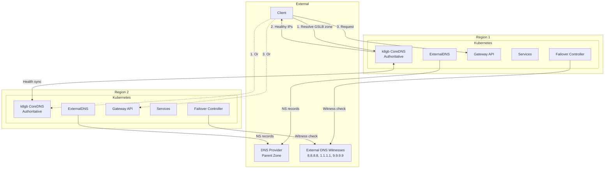
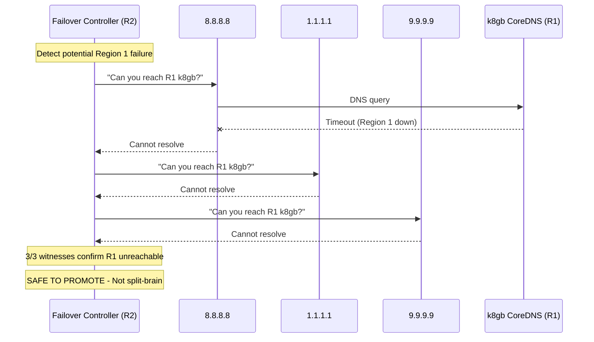
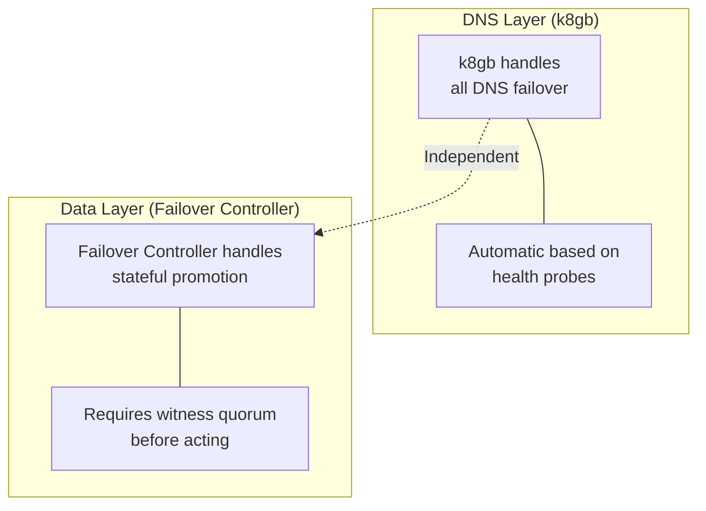
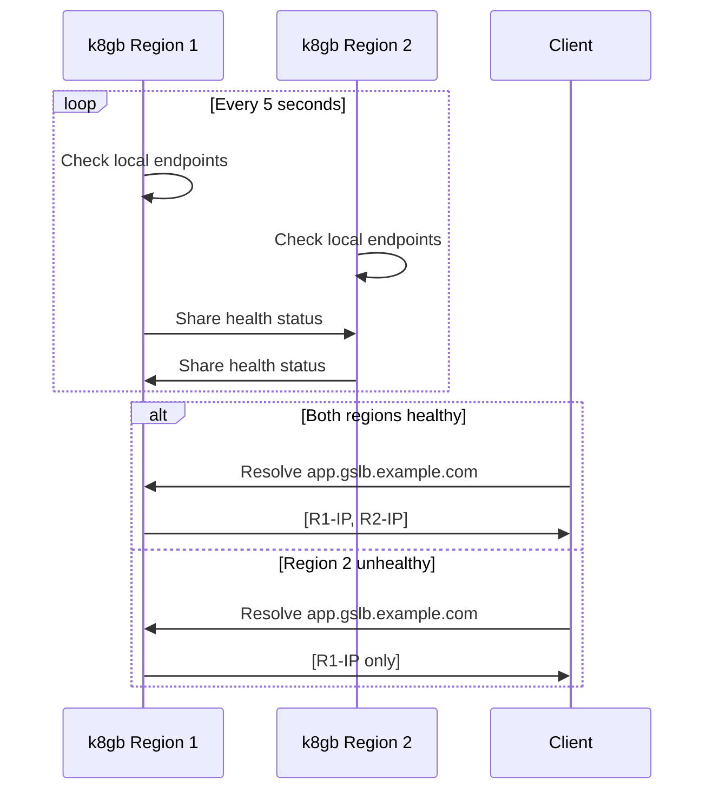
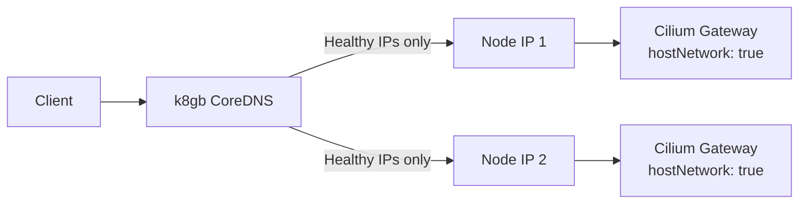

# ADR: k8gb for Global Server Load Balancing

**Status:** Accepted
**Date:** 2024-10-01
**Updated:** 2026-01-17

## Context

Need cross-region DNS-based load balancing that:
- Routes traffic to healthy endpoints only
- Supports active-active and active-passive strategies
- Works without external GSLB services (self-hosted)
- Acts as authoritative DNS for GSLB zone
- Prevents split-brain scenarios during failover

## Decision

Use **k8gb** (Kubernetes Global Balancer) for cross-region GSLB with:
- k8gb CoreDNS as **authoritative DNS** for GSLB zone
- **External DNS witnesses** (8.8.8.8, 1.1.1.1, 9.9.9.9) for split-brain protection
- Integration with ExternalDNS for parent zone records

## Architecture



## k8gb as Authoritative DNS

k8gb CoreDNS serves as the **authoritative DNS server** for the GSLB zone:

### DNS Hierarchy

```
example.com                    → DNS Provider (Cloudflare, Hetzner)
  └── gslb.example.com (NS)    → k8gb CoreDNS (authoritative)
        ├── app.gslb.example.com     → R1, R2 IPs (health-based)
        ├── api.gslb.example.com     → R1, R2 IPs (health-based)
        └── db.gslb.example.com      → Primary region only (failover)
```

### NS Record Setup

ExternalDNS creates NS records pointing to k8gb LoadBalancer IPs:

```yaml
# Created by ExternalDNS in parent zone
gslb.example.com.  NS  ns1.gslb.example.com.
gslb.example.com.  NS  ns2.gslb.example.com.
ns1.gslb.example.com.  A  <k8gb-region1-lb-ip>
ns2.gslb.example.com.  A  <k8gb-region2-lb-ip>
```

## Split-Brain Protection

### External DNS Witnesses

To prevent split-brain during network partitions, the **Failover Controller** queries external DNS witnesses before triggering data service failovers:

| Resolver | Provider | Purpose |
|----------|----------|---------|
| 8.8.8.8 | Google | Primary witness |
| 1.1.1.1 | Cloudflare | Secondary witness |
| 9.9.9.9 | Quad9 | Tertiary witness |

### Quorum-Based Detection



**Quorum requirement:** 2 out of 3 witnesses must agree the other region is unreachable.

| 8.8.8.8 | 1.1.1.1 | 9.9.9.9 | Decision |
|---------|---------|---------|----------|
| ✅ | ✅ | ✅ | Region UP - no action |
| ✅ | ✅ | ❌ | Region UP - no action |
| ✅ | ❌ | ❌ | **Region DOWN** - 2/3 agree |
| ❌ | ❌ | ❌ | **Region DOWN** - 3/3 agree |

See [SPEC-SPLIT-BRAIN-PROTECTION](../../handbook/docs/specs/SPEC-SPLIT-BRAIN-PROTECTION.md) for detailed algorithm.

## Component Responsibilities

### k8gb vs Failover Controller vs ExternalDNS

| Component | Responsibility | When Active |
|-----------|---------------|-------------|
| **k8gb** | DNS-based traffic routing (automatic failover) | Always |
| **Failover Controller** | Stateful service promotion (CNPG, MongoDB) | Only when region actually fails |
| **ExternalDNS** | NS record delegation (one-time setup) | Only for initial delegation |

### Key Clarifications

**Q: Does k8gb make Failover Controller redundant for DNS failover?**
A: Yes. k8gb handles all DNS failover natively. Failover Controller is ONLY needed for **data service promotion** (e.g., promoting CNPG replica to primary). If you only have stateless services, you don't need Failover Controller at all.

**Q: Do we need ExternalDNS if k8gb manages the GSLB zone?**
A: ExternalDNS is only needed once to create NS records delegating `gslb.example.com` to k8gb CoreDNS. After that, k8gb is authoritative and manages all GSLB records. ExternalDNS can also manage non-GSLB records (static A records in parent zone).

**Q: Can k8gb manage external SaaS services?**
A: No. k8gb only manages Kubernetes endpoints. External SaaS services should be accessed directly via their URLs.

### Separation of Concerns



**Why separate?**
- DNS failover should be instant (30s TTL)
- Data promotion must be verified (prevent split-brain data corruption)
- k8gb might flap; Failover Controller requires witness consensus

## Active-Passive with k8gb

k8gb supports active-passive natively via weight annotations:

### Primary Region (weight: 100)

```yaml
apiVersion: k8gb.absa.oss/v1beta1
kind: Gslb
metadata:
  name: app
  annotations:
    k8gb.io/primary-geotag: "region-1"
    k8gb.io/weight-region-1: "100"
    k8gb.io/weight-region-2: "0"
spec:
  strategy:
    type: failover  # Active-Passive
```

### Failover Behavior

| Scenario | Region 1 Weight | Region 2 Weight | Traffic |
|----------|-----------------|-----------------|---------|
| Both healthy | 100 | 0 | 100% Region 1 |
| Region 1 fails | - | 100 (auto) | 100% Region 2 |
| Region 1 recovers | 100 | 0 | Back to Region 1 |

**Note:** k8gb automatically adjusts weights when health checks fail. No Failover Controller involvement needed for DNS.

## How k8gb Works

### Health-Based DNS Routing



### k8gb as "Poor Man's LoadBalancer"

For cost-conscious deployments without cloud LoadBalancers:



**How it works:**
1. Cilium Gateway uses `hostNetwork: true` to bind directly to node IPs
2. k8gb health-checks the Gateway endpoints
3. k8gb CoreDNS returns only healthy node IPs
4. Client connects directly to healthy nodes

**Cost:** Free (no cloud LoadBalancer required)

## Routing Strategies

| Strategy | Description | Use Case |
|----------|-------------|----------|
| `roundRobin` | Even distribution across healthy endpoints | Active-Active |
| `failover` | Primary region preferred, DR on failure | Active-Passive |
| `geoip` | Route by client geography | Latency optimization |

### GeoIP Limitations

**Important:** GeoIP routing has inherent DNS limitations:

- DNS queries come from **resolver IPs**, not client IPs
- Client at `203.0.113.1` (Asia) queries `8.8.8.8` → k8gb sees Google's IP (US)
- EDNS Client Subnet (ECS) mitigates this, but not universally supported

| DNS Resolver | ECS Support | Accuracy |
|--------------|-------------|----------|
| Google (8.8.8.8) | Yes | Good |
| Cloudflare (1.1.1.1) | No (privacy) | Poor |
| ISP resolvers | Varies | Varies |

**Recommendation:** Use `failover` or `roundRobin` for predictable behavior. Use `geoip` only when latency optimization is critical and you accept the limitations.

## Configuration

### Gslb Custom Resource

```yaml
apiVersion: k8gb.absa.oss/v1beta1
kind: Gslb
metadata:
  name: <tenant>-app
  namespace: <tenant>
spec:
  ingress:
    ingressClassName: cilium  # Cilium Gateway
    rules:
      - host: app.gslb.<domain>
        http:
          paths:
            - path: /
              pathType: Prefix
              backend:
                service:
                  name: app-service
                  port:
                    number: 80
  strategy:
    type: roundRobin  # or failover, geoip
    splitBrainThresholdSeconds: 300
    dnsTtlSeconds: 30
```

### k8gb Deployment

```yaml
apiVersion: apps/v1
kind: Deployment
metadata:
  name: k8gb
  namespace: k8gb
spec:
  replicas: 1
  template:
    spec:
      containers:
        - name: k8gb
          image: absaoss/k8gb:v0.12.0
          args:
            - --config=/etc/k8gb/config.yaml
          env:
            - name: CLUSTER_GEO_TAG
              value: "<region>"
            - name: EXT_GSLB_CLUSTERS_GEO_TAGS
              value: "<other-region>"
```

### k8gb CoreDNS Configuration

```yaml
# k8gb CoreDNS serves as authoritative for GSLB zone
.:5353 {
    k8gb_coredns
    health
    ready
    prometheus :9153
}
```

## TTL Configuration

| Setting | Value | Purpose |
|---------|-------|---------|
| DNS TTL | 30s | Balance caching vs failover speed |
| Health check interval | 5s | Detect failures quickly |
| Split-brain threshold | 300s | Prevent flapping |

**Failover time:** 30-60 seconds (DNS TTL + propagation)

## Monitoring

### Metrics

| Metric | Description |
|--------|-------------|
| `k8gb_gslb_healthy_records` | Healthy endpoint count |
| `k8gb_gslb_status` | GSLB status (0=unhealthy, 1=healthy) |
| `k8gb_gslb_reconcile_*` | Reconciliation metrics |

### Alerts

| Alert | Condition | Severity |
|-------|-----------|----------|
| GslbEndpointDown | healthy_records < expected | Warning |
| GslbAllEndpointsDown | healthy_records = 0 | Critical |
| GslbSplitBrain | clusters disagree on health | Warning |

## Consequences

**Positive:**
- Self-hosted authoritative DNS for GSLB (no external dependency)
- Health-based routing (only healthy endpoints)
- External witness verification prevents split-brain
- Multiple routing strategies
- Native Kubernetes integration

**Negative:**
- DNS-based (subject to TTL delays)
- Requires cross-cluster communication
- Requires external DNS witnesses for split-brain protection

## Related

- [ADR-FAILOVER-CONTROLLER](../../failover-controller/docs/ADR-FAILOVER-CONTROLLER.md)
- [SPEC-SPLIT-BRAIN-PROTECTION](../../handbook/docs/specs/SPEC-SPLIT-BRAIN-PROTECTION.md)
- [ADR-EXTERNAL-DNS](../../external-dns/docs/ADR-EXTERNAL-DNS.md)
- [SPEC-DNS-FAILOVER](../../handbook/docs/specs/SPEC-DNS-FAILOVER.md)
- [ADR-MULTI-REGION-STRATEGY](../../handbook/docs/adrs/ADR-MULTI-REGION-STRATEGY.md)
